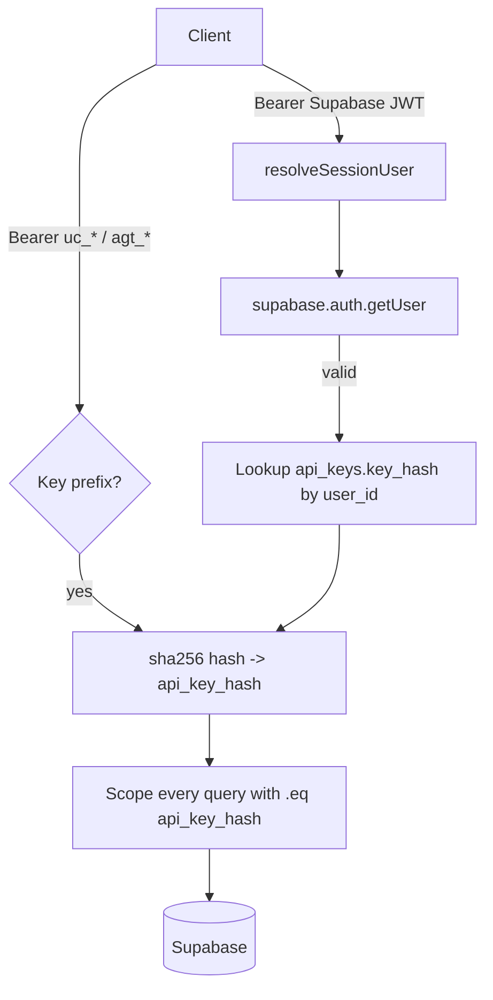

# UnClick - Current-State Architecture Map

**Phase 1 Ground Floor QC. Generated 2026-04-24. Read-only snapshot of `main` at commit `4f655f2`.**

This document is the investor-readable reality map of the `unclick-agent-native-endpoints` repository. Every claim cites a concrete file path or migration. Nothing in this document is aspirational. For the target-state design, see [`target-state.md`](./target-state.md).

---

## 1. Repository structure

```
unclick-agent-native-endpoints/
├── api/                    # Vercel serverless functions (22 files, ~10.1k LOC)
├── apps/                   # Workspace app roots (currently only apps/api, a Hono service)
├── packages/               # Published / publishable npm workspace packages (6 dirs)
├── src/                    # React SPA (Vite + TypeScript)
├── supabase/
│   └── migrations/         # 43 SQL migrations (chronological, prefixed 20260409..20260423)
├── scripts/                # Build + deployment helpers
├── public/                 # Static assets, /.well-known
├── docs/                   # Session summaries + templates (this file lives under docs/)
├── .github/                # CI/CD workflows + OPERATIONS.md
├── .auto-memory/           # Auto-load memory harness state
├── .claude/                # Claude Code harness configuration
├── package.json            # Root workspace (name: "unclick") with workspaces: packages/*, apps/*
├── vercel.json             # Deployment + rewrites + 2 cron schedules
├── turbo.json              # Turbo pipeline config
└── tsconfig.json           # Shared TS config
```

Top-level is a **pnpm/npm-workspace monorepo** rooted at `package.json:6-9` (`workspaces: ["packages/*", "apps/*"]`). The Vite SPA lives at the root (`src/`), not under `apps/`, which means the root repo is simultaneously the website workspace and the monorepo root. Turbo is present (`turbo.json`) but lightly used.

---

## 2. Package inventory (`packages/*`)

| Package | Version | Main entry | Purpose | Cross-deps |
|---|---|---|---|---|
| `@unclick/mcp-server` | 0.3.0 | `dist/server.js` | THE npm package. MCP server exposing 5 memory tools + `unclick_search` meta-tool + 200+ wired endpoints. CLI bin: `unclick-mcp`. | @modelcontextprotocol/sdk, @supabase/supabase-js, zod |
| `@unclick/memory-mcp` | 0.2.0 | `dist/index.js` | **DEPRECATED** per root `CLAUDE.md`. Standalone memory MCP kept for reference. 6-layer architecture (business context, sessions, facts, library, conversations, code). | @modelcontextprotocol/sdk, @supabase/supabase-js, zod |
| `@unclick/core` | 0.0.1 | `src/index.ts` | Shared auth/response/schema types for Hono-based apps. Used by `apps/api`. | drizzle-orm, hono, ulid, zod |
| `@unclick/testpass` | 0.1.0 | `dist/index.js` | QA pack runner for MCP servers. Loads YAML packs, runs probes, emits compliance reports. | @anthropic-ai/sdk, js-yaml, zod |
| `@unclick/channel` (channel-plugin) | 0.1.0 | `index.js` | CLI that routes admin chat through a local Claude Code session so the web UI does not need its own AI key. | @supabase/supabase-js |
| `@unclick/organiser-mcp` | n/a (schema only) | `schema.sql` only | **Shell package**. No `package.json`, only a 23KB `schema.sql` for Mission Control. |

Observations:
- `packages/mcp-server` is the commercial product. Everything else is either deprecated, adjunct tooling, or a shell.
- `packages/mcp-server/src/tool-wiring.ts` is the largest single TS file in the repo: ~447 KB of procedural tool registrations. `catalog.ts` (~70 KB) and `local-catalog-handlers.ts` (~60 KB) duplicate parts of the metadata.
- No cross-package imports between `mcp-server`, `memory-mcp`, and `core`. `core` is consumed only by `apps/api` (the Hono service), not by the Vercel serverless layer.

---

## 3. API surface (`api/*` - Vercel serverless functions)

22 TypeScript entry points. Every file is a Vercel handler (`(req: VercelRequest, res: VercelResponse) => Promise<void>`).

| File | LOC | Purpose |
|---|---:|---|
| `api/memory-admin.ts` | **5,401** | **God-file.** 92-branch action switch for memory CRUD, admin dashboard queries, setup wizard, channel chat, crews, testpass, signals, build desk, nightly decay cron. See section 4. |
| `api/arena.ts` | 570 | Problem board: leaderboard, solutions, bot runs, daily problem selection. Mostly inline seed data. |
| `api/backstagepass.ts` | 855 | Credential vault: AES-256-GCM at rest, PBKDF2 key derivation, proof-of-possession auth (JWT + plaintext api_key via timing-safe compare), full audit log writes. |
| `api/testpass.ts` | 457 | TestPass run orchestrator: start/stop/read runs, pack management. |
| `api/install-ticket.ts` | 428 | 24h install tickets for returning users to recover an API key without re-auth. |
| `api/mcp.ts` | 317 | MCP server discovery endpoint. Resolves `api_key_hash` to tool catalog. |
| `api/developer-submit-tool.ts` | 250 | Developer marketplace intake form. |
| `api/credentials.ts` | 234 | Legacy credential vault (predecessor to backstagepass.ts). Crypto logic duplicated. |
| `api/report-bug.ts` | 235 | Bug intake + PostHog event. |
| `api/oauth-callback.ts` | 231 | OAuth2 callback for Xero, Reddit, Shopify platform connectors. |
| `api/signals-dispatch.ts` | 187 | Cron-triggered signal fan-out. |
| `api/testpass-run.ts` | 172 | Single-run detail + streaming output. |
| `api/trace.ts` | 145 | Agent trace event ingestion. |
| `api/developer-dashboard.ts` | 142 | Developer stats. |
| `api/developer-stripe-onboard.ts` | 139 | Stripe Connect onboarding for payouts. |
| `api/admin-users.ts` | 125 | Admin-gated user search. |
| `api/sitemap.ts` | 104 | XML sitemap. |
| `api/webhook.ts` | 95 | Webhook ingress. |
| `api/developer-submission-status.ts` | 59 | Status check for developer submission. |
| `api/lib/*`, `api/memory/*`, `api/tools/*` | - | Helpers: `posthog.ts` client, OpenAI embedder (`memory/embed.ts`), demo tool. |

### Vercel routing (`vercel.json`)

```
/sitemap.xml        -> /api/sitemap
/v1/arena/*         -> /api/arena
/v1/report-bug      -> /api/report-bug
/api/oauth-callback -> /api/oauth-callback
/api/credentials    -> /api/credentials
/api/mcp            -> /api/mcp
/(.*)               -> /index.html      (SPA fallback)
```

Two cron jobs (`vercel.json:18-27`):
- `/api/memory-admin?action=nightly_decay` at `0 4 * * *` (daily 04:00 UTC).
- `/api/signals-dispatch` every minute.

### `apps/api/` (separate from Vercel `api/`)

`apps/api/` is a **Hono service** built on top of `@unclick/core` with Cloudflare Workers ergonomics. It has its own `drizzle-orm` setup and an **in-memory sliding-window rate limiter** (`apps/api/src/middleware/rate-limit.ts`, lines 1-67; limits: free=60, pro=300, team=1000 req/min). It is not the user-facing Vercel endpoint surface. It appears to be an experimental / next-gen API layer that has not yet replaced Vercel serverless.

---

## 4. `api/memory-admin.ts` - the god-file (92 actions)

This single handler is 5,401 LOC and dispatches on `req.query.action`. Auth pattern (lines 336-391): a Bearer token is either a raw `uc_*` / `agt_*` UnClick API key (hashed directly via SHA-256) **or** a Supabase session JWT (validated via `supabase.auth.getUser()`, then the user's `api_key_hash` is looked up server-side from `api_keys`). The helper `resolveApiKeyHash()` unifies both paths so the client never supplies its own `api_key_hash`.

Full action catalog (grouped):

### Memory reads (all scope queries with `.eq("api_key_hash", hash)`)
`status`, `business_context`, `sessions`, `facts`, `library`, `library_doc`, `conversations`, `code`, `search`, `admin_memory_activity`, `admin_search`, `admin_sessions`, `admin_library`, `admin_session_preview`, `admin_export_all`, `admin_memory_load_metrics`, `admin_missed_context_alerts`, `admin_check_connection`.

### Memory writes (POST, scoped)
`delete_fact` (1514-1529), `delete_session` (1531-1546), `update_business_context` (1548-1575), `admin_update_fact` (3630-3665), `admin_fact_add` (3822-3859), `admin_context_apply_template` (3860-3939), `admin_clear_all` (3976-4014) **<- destructive nuke, body.confirm==="DELETE"**.

### BYOD setup
`setup` (2019-2096) stores an encrypted **Supabase service-role key** per user in `memory_configs` (AES-256-GCM + PBKDF2). `config` (2110-2156) decrypts and returns it to the MCP server. `setup_status`, `disconnect`, `admin_generate_config`.

### Devices / conflict / tools
`device_check`, `list_devices`, `auth_device_list`, `auth_device_revoke`, `remove_device`, `conflict_check`, `conflict_detect`, `conflict_dismiss`, `conflict_resolve`, `tool_detect`, `dismiss_tool_nudge`, `admin_tools`, `admin_tool_scan`, `admin_connectors_list`.

### Agents / crews / testpass
`admin_agents_list`, `admin_agent_get`, `admin_agent_create`, `admin_agent_update`, `admin_agent_delete`, `admin_agent_tools_update`, `admin_agent_memory_update`, `admin_agent_duplicate`, `admin_agent_activity`, `admin_agent_resolve`, `list_agents`, `clone_agent`, `create_agent`, `update_agent`, `list_crews`, `create_crew`, `update_crew`, `delete_crew`, `start_crew_run`, `get_run`, `list_runs`, `list_testpass_runs`, `list_testpass_packs`, `get_testpass_run`, `start_testpass_run`.

### Signals
`list_signals`, `check_signals`, `mark_signal_read`, `mark_all_read`, `get_signal_preferences`, `update_signal_preferences`.

### Channel (local Claude Code chat routing)
`admin_channel_send`, `admin_channel_poll`, `admin_channel_status`, `admin_channel_heartbeat`, `admin_ai_chat` (Gemini fallback via `@ai-sdk/google`).

### Build Desk
`admin_build_tasks` (nested switch: list/get/create/update_status/soft_delete), `admin_build_workers` (list/register/update/delete/health_check), `admin_build_dispatch`.

### Account lifecycle
`admin_profile` (3252-3351, auto-provisions an `api_key` on first call), `generate_api_key` (3354-3397), `reset_api_key` (3398-3431), `delete_account` (3432-3582, **the only write path with a full audit log** to `account_deletions_audit` + `backstagepass_audit` before the delete cascade).

### Cron
`nightly_decay` (4063-4125, requires `CRON_SECRET` Bearer, iterates all non-free `api_keys`, calls `mc_manage_decay` RPC per tenant).

### Tenant settings
`tenant_settings_get`, `tenant_settings_set`, `tenant_settings` (nested get/set), `admin_get_autoload_settings`, `admin_update_autoload_settings`, `log_tool_event`, `admin_profile`, `admin_bug_reports`.

### Misc
`admin_get_setup_guide` (no auth - pure content lookup), `health_summary`.

Cross-cutting observations:
- **Only `delete_account` audit-logs.** `admin_clear_all` (a full user-memory nuke) does not.
- Three actions (`setup_status`, `conflict_check`, `health_summary`) accept the api_key via **query parameter** as well as Bearer. Query params leak to access logs.
- **`admin_tools` reads `platform_connectors` with no WHERE clause** (line 3602-3604). See security doc.
- Zod is imported but not used to validate request bodies in the main handler. Validation is ad-hoc (`if (!field)`).

---

## 5. Frontend inventory (`src/pages/*`)

### Top-level routes (extracted from `src/App.tsx:87-172`)

| Path | Component | File |
|---|---|---|
| `/` | `Index` | `src/pages/Index.tsx` |
| `/docs` | `DocsPage` | `src/pages/Docs.tsx` |
| `/faq` | `FAQPage` | `src/pages/FAQPage.tsx` |
| `/tools` | `ToolsPage` | `src/pages/Tools.tsx` (571 LOC) |
| `/tools/link-in-bio` `/tools/scheduling` `/tools/solve` | 3 tool pages | `src/pages/tools/` |
| `/arena`, `/arena/leaderboard`, `/arena/submit`, `/arena/:id` | Arena suite | `src/pages/arena/` |
| `/developers`, `/developers/docs`, `/developers/submit`, `/developers/vibe-coding` | Developer platform | `src/pages/Developers*.tsx` |
| `/memory`, `/memory/setup`, `/memory/connect`, `/memory/setup-guide` | Memory setup | `src/pages/Memory*.tsx` |
| `/memory/admin` -> `/admin/memory` (Navigate) | redirect | - |
| `/connect/:platform` | `ConnectPage` | `src/pages/Connect.tsx` (547 LOC) |
| `/backstagepass` | `BackstagePassPage` | `src/pages/BackstagePass.tsx` |
| `/crews` | `CrewsPage` | `src/pages/Crews.tsx` |
| `/dispatch` | `DispatchPage` | `src/pages/Dispatch.tsx` |
| `/organiser` | `OrganiserPage` | `src/pages/Organiser.tsx` |
| `/build` | `BuildDeskPage` | `src/pages/BuildDesk.tsx` |
| `/new-to-ai`, `/smarthome`, `/pricing`, `/terms`, `/privacy` | marketing | - |
| `/i` | `InstallRecoverPage` | `src/pages/InstallRecover.tsx` |
| `/login`, `/signup`, `/auth/callback`, `/auth/verify-mfa` | Auth surface | `src/pages/Login/Signup/...` |
| `/settings` -> `/admin/settings` (Navigate) | redirect | - |
| `*` | `NotFound` | - |

### Admin shell (nested, auth-gated via `<RequireAuth>`)

`/admin/*` mounts `AdminShell` from `src/pages/admin/AdminShell.tsx`. Child routes:

Authenticated-only:
- `/admin/you` (AdminYou), `/admin/memory`, `/admin/keychain`, `/admin/tools`, `/admin/activity`, `/admin/settings`, `/admin/agents`.
- `/admin/testpass` + `testpass/new` + `testpass/runs/:id` + `testpass/packs/:id/edit`.
- `/admin/crews` + `crews/new` + `crews/:id/edit` + `crews/runs` + `crews/runs/:runId` + `crews/settings`.
- `/admin/signals` + `signals/settings`.

Admin-only (wrapped in `<RequireAdmin>`):
- `/admin/analytics`, `/admin/codebase`, `/admin/orchestrator`, `/admin/users`, `/admin/system-health`, `/admin/moderation`, `/admin/audit-log`.

Admin is gated by the `ADMIN_EMAILS` env var (checked in `api/admin-users.ts` and `api/memory-admin.ts#admin_profile`).

### `src/lib/*` (shared frontend helpers)

`analytics.ts`, `auth.ts`, `communityTools.ts`, `configGenerator.ts`, `connectors.ts`, `context-file-generator.ts`, `install-ticket.ts`, `posthog.ts`, `supabase.ts`, `utils.ts`, plus `crews/` (contains `engine.ts`, the council engine orchestrator, 203 LOC) and `signals/` (contains `emit.ts`).

Notably `src/lib/crews/engine.ts` is imported **from the API layer** (`api/memory-admin.ts` imports `runCouncilEngine` from `../src/lib/crews/engine`). The "library" code lives under `src/` but is used by serverless functions. This is a structural smell: `src/` is the React SPA; serverless imports crossing that boundary mean the React bundle and the server runtime share code paths that were never designed to be isomorphic.

---

## 6. Database schema inventory

43 migrations, ~4,024 SQL LOC, spanning 2026-04-09 to 2026-04-23.

### CREATE TABLE census

**Keychain / developer platform** (`20260410100000_keychain_mvp.sql` + expansions):
- `api_keys` (line 2), `platform_credentials` (16), `platform_connectors` (31), `metering_events` (44), `connection_tests` (`..._connection_tests.sql:1`).

**Memory - managed cloud** (`20260415000000_memory_managed_cloud.sql`):
- `mc_business_context` (27), `mc_knowledge_library` (46), `mc_knowledge_library_history` (66), `mc_session_summaries` (99), `mc_extracted_facts` (117), `mc_conversation_log` (139), `mc_code_dumps` (157).

**Memory - BYOD** (`20260414000000_memory_byod.sql`):
- `memory_configs` (8) **<- stores encrypted Supabase service-role key per user**.
- `memory_devices` (31).

**Memory - bitemporal / audit** (`20260422010000_memory_bitemporal_and_provenance.sql`):
- `mc_canonical_docs` (56), `canonical_docs` (73), `mc_facts_audit` (113), `facts_audit` (127).

**Memory - other**:
- `memory_load_events` (`20260417000000_memory_load_events.sql:7` and `20260417010000_...:8` - note duplicate migration timestamp under 8601 "HHMMSS"; see section 9).
- `mc_memory_health` (`20260420010000_memory_health.sql:22`).
- `mc_skills` (`20260420000000_mc_skills.sql:17`).

**Auth** (`20260416000000_auth_foundation.sql`):
- `auth_devices` (142).

**Install tickets** (`20260414100000_install_tickets.sql`):
- `install_tickets` (13).

**Tenant settings**:
- `tenant_settings` is created in **three** migrations: `20260417000000_tenant_settings.sql:9`, `20260418000000_agents_and_tenant_settings.sql:8`, and `20260418000000_tenant_settings.sql:9`. All use `CREATE TABLE IF NOT EXISTS` so they do not error, but it is structurally duplicative (see section 9).

**Agents**:
- `agents`, `agent_tools`, `agent_memory_scope`, `agent_activity` are created in **two** migrations: `20260418000000_agent_profiles.sql:6-58` and `20260418000000_agents_and_tenant_settings.sql:56-99`. Idempotent but duplicative.

**Channels (local Claude Code chat)** (`20260418000000_channels_orchestrator.sql`):
- `chat_messages` (18), `channel_status` (65).

**Conflict / tool detection**:
- `conflict_detections`: `20260418000000_conflict_detection.sql:7` and `20260418000000_agents_and_tenant_settings.sql:22`.
- `tool_detections`: `20260418000000_tool_detections.sql:8` and `20260418000000_agents_and_tenant_settings.sql:39`.

**Build Desk** (`20260417000000_build_desk.sql`):
- `build_tasks` (9), `build_workers` (30), `build_dispatch_events` (49). **No RLS** (see section 7).

**BackstagePass** (`20260420030000_user_credentials.sql`, `20260420100000_backstagepass_audit.sql`):
- `user_credentials` (16, AES-256-GCM vault), `backstagepass_audit` (21, append-only log).

**Agent trace** (`20260420050000_agent_trace.sql`):
- `agent_trace` (22).

**Crews** (`20260423000000_crews_phase_b.sql`, `20260423100000_crews_phase_c.sql`):
- `mc_agents`, `mc_crews`, `mc_crew_runs` (Phase B). Phase C extends (idempotent).

**TestPass** (`20260421040000_testpass_schema.sql` + `20260423200000_testpass_run_ui_fields.sql`):
- `testpass_packs`, `testpass_runs` (plus UI fields migration).

**Signals** (`20260423300000_signals_phase_1.sql`):
- `mc_signals` (1), `mc_signal_preferences` (25).

**Account deletions audit** (`20260423200000_account_deletions_audit.sql`):
- `account_deletions_audit` (4).

**Other**:
- `bug_reports` (pre-existing from prior migrations; `20260418010000_bug_reports_api_key.sql` adds `api_key_hash`).

### Row Level Security census

**RLS-enabled tables (31 confirmed via grep of all migrations)**:

`mc_business_context`, `mc_knowledge_library`, `mc_knowledge_library_history`, `mc_session_summaries`, `mc_extracted_facts`, `mc_conversation_log`, `mc_code_dumps`, `install_tickets`, `auth_devices`, `connection_tests`, `api_keys`, `platform_credentials`, `platform_connectors`, `metering_events`, `agents`, `agent_tools`, `agent_memory_scope`, `agent_activity`, `chat_messages`, `channel_status`, `mc_skills`, `mc_memory_health`, `agent_trace`, `user_credentials`, `backstagepass_audit`, `mc_signals`, `mc_signal_preferences`, `mc_canonical_docs`, `mc_facts_audit`, `canonical_docs`, `facts_audit`, `account_deletions_audit`.

**Tables WITHOUT RLS (confirmed gaps)**:

- `memory_configs` - **critical**, holds encrypted Supabase service-role keys.
- `memory_devices`.
- `build_tasks`, `build_workers`, `build_dispatch_events` (per `20260417000000_build_desk.sql` - no RLS statement).
- `memory_load_events` (neither of the two duplicate migrations enables RLS).
- `tenant_settings` (none of the three creation migrations enables RLS).
- `conflict_detections`, `tool_detections` (standalone creation migrations have no RLS).
- `bug_reports` - RLS status unclear.
- `mc_agents`, `mc_crews`, `mc_crew_runs` - RLS status unverified (Phase B migration is 52KB; needs audit).

### Policy patterns observed

1. **service_role_all**: `FOR ALL TO service_role USING (true) WITH CHECK (true)` on most tables (server bypass).
2. **block_anon_access** + **block_authenticated_direct_access**: Used for sensitive tables (`user_credentials`, `agent_trace`, `backstagepass_audit`) so only service_role can touch them.
3. **User-scoped policies**: `mc_agents_read_own_or_system`, `mc_agents_write_own`, `Users can manage their own canonical_docs`.
4. **"No direct access"**: on `install_tickets`, `chat_messages`, `channel_status` - reserved for Vercel API only.

Tenant isolation is **enforced at the application layer**, not by RLS. The serverless functions use the service-role key and add `.eq("api_key_hash", hash)` to every query. RLS is a secondary defense against direct Supabase client calls.

---

## 7. Auth + tenancy model



- **Bearer-header-only** on every sensitive action (except `setup_status`, `conflict_check`, `health_summary`, which also accept `?api_key=...`).
- Session JWT path (browser) never trusts the client-supplied `api_key_hash`; it always re-derives it server-side from `api_keys` via `user_id`. This defends against replayed localStorage tokens across accounts.
- `resolveSessionTenant()` is the same idea with ADMIN_EMAILS gating for admin-only reads.

---

## 8. Dependency hot paths

```mermaid
flowchart LR
    subgraph "Vercel runtime"
        MA[api/memory-admin.ts]
        BP[api/backstagepass.ts]
        CR[api/credentials.ts]
        AR[api/arena.ts]
    end
    subgraph "Shared libs (src/lib)"
        CE[crews/engine.ts]
        SE[signals/emit.ts]
    end
    subgraph "External"
        SB[(Supabase)]
        AG[ai + @ai-sdk/google]
        AN[@ai-sdk/anthropic]
        CY[crypto - PBKDF2 + AES-GCM]
    end
    MA --> SB
    MA --> CE
    MA --> SE
    MA --> AG
    MA --> CY
    CE --> AN
    CE --> SB
    BP --> CY
    BP --> SB
    CR --> CY
    CR --> SB
    AR --> SB
```

- **No circular imports** detected.
- `api/memory-admin.ts` imports from `../src/lib/crews/engine` - the API layer reaches into the React app's lib code. See section 5 observation.
- **Crypto code is duplicated** across `api/backstagepass.ts:63-88`, `api/credentials.ts`, and `api/memory-admin.ts:106-130`. Same PBKDF2 + AES-256-GCM primitives three times.

---

## 9. Business-logic hot spots / god files

| Category | Path | LOC | Notes |
|---|---|---:|---|
| God-handler | `api/memory-admin.ts` | 5,401 | 92-branch switch. |
| Tool registry | `packages/mcp-server/src/tool-wiring.ts` | ~447 KB | Procedural wiring for ~200 endpoints. |
| Tool metadata | `packages/mcp-server/src/catalog.ts` | ~70 KB | Duplicates some of tool-wiring.ts. |
| Catalog handlers | `packages/mcp-server/src/local-catalog-handlers.ts` | ~60 KB | Search/filter/recommend logic. |
| Local tools | `packages/mcp-server/src/local-tools.ts` | ~38 KB | Bundled utility tools. |
| MCP server entry | `packages/mcp-server/src/server.ts` | ~40 KB | Request routing + dispatch. |
| Credential vault | `api/backstagepass.ts` | 855 | Security-critical. |
| Arena | `api/arena.ts` | 570 | Inline seed data. |
| Developer docs page | `src/pages/DeveloperDocs.tsx` | 632 | Content-heavy. |
| Tools marketplace UI | `src/pages/Tools.tsx` | 571 | Search + filter + tabs. |
| OAuth/connect flow | `src/pages/Connect.tsx` | 547 | Per-platform OAuth UX. |
| Smart Home page | `src/pages/SmartHome.tsx` | 541 | Marketing long-form. |
| BYOD memory wizard | `src/pages/MemorySetup.tsx` | 504 | User enters service-role key. |
| Cloud memory connect | `src/pages/MemoryConnect.tsx` | 503 | Device auth. |

### Structural smells

1. **Duplicate migration timestamps**. The filename convention is `YYYYMMDDHHMMSS_name.sql`, yet six files share the exact prefix `20260418000000` (`agent_profiles`, `agents_and_tenant_settings`, `channels_orchestrator`, `conflict_detection`, `tenant_settings`, `tool_detections`). Supabase applies in filename-sort order; collisions resolve deterministically but make cherry-picking fragile.
2. **Duplicate `tenant_settings` / `agents` / `conflict_detections` / `tool_detections` definitions**. Idempotent today; risk if columns diverge tomorrow.
3. **Two `memory_load_events` creation migrations** at `20260417000000` and `20260417010000`.
4. **Crypto duplicated three times** across the api/ layer.
5. **Cross-boundary import** from `api/memory-admin.ts` into `src/lib/crews/engine.ts`.
6. **No service / repository layer**. Every Vercel handler talks to Supabase directly with inline SQL-ish filter chains.

---

## 10. Type duplication

Concepts that are typed or schema-defined in 2+ places:

| Concept | Appears in |
|---|---|
| `User` | `@unclick/core/src/types.ts`, Supabase Auth directly in `src/pages/Login.tsx` / `Signup.tsx`, `api/admin-users.ts`. |
| `Fact` / `ExtractedFact` | `packages/memory-mcp/src/types.ts`, `mc_extracted_facts` table, inline shapes in `api/memory-admin.ts`. |
| `ApiKey` / `ApiKeyContext` | `api/mcp.ts` (`interface ApiKeyContext`), `api_keys` table, inline usage everywhere. |
| `Credential` | `user_credentials` table, `api/backstagepass.ts` inline, `api/credentials.ts` inline. |
| `Agent` / `AgentProfile` | `api/arena.ts` (`interface AgentProfile`), `agents` table, `mc_agents` table, `src/pages/admin/agentTemplates.ts`. |
| `Crew` / `CrewTemplate` | `mc_crews` table, `src/pages/admin/crews/CrewComposer.tsx`, `src/lib/crews/engine.ts`, `src/data/starterCrews.ts`. |
| `Problem` / `Solution` / `Comment` | `api/arena.ts` interfaces, `src/pages/arena/ArenaComments.tsx` local types. |
| `Signal` / `SignalRow` | `api/signals-dispatch.ts` (`interface SignalRow`), `mc_signals` table, `src/pages/admin/signals/*`. |
| `SessionSummary` | `mc_session_summaries` table, `packages/memory-mcp/src/types.ts`, inline in `api/memory-admin.ts`. |
| `Tool` | `packages/mcp-server/src/catalog.ts`, `packages/mcp-server/src/tool-wiring.ts`, `src/pages/Tools.tsx` (`interface Tool`). |

There is no shared TypeScript types package. `@unclick/core` has the right shape to become one but is currently consumed only by `apps/api`.

---

## 11. CI/CD surface

Workflows under `.github/workflows/`:
- `claude.yml` - `@claude` mention triggers Claude Code against the cloud repo.
- `ci.yml` - lint + typecheck + tests.
- `apply-migrations.yml` - Supabase migration applier.
- `testpass-pr-check.yml` - runs TestPass on PRs.

Deployment: Vercel auto-deploys on push to `main` via GitHub integration (no GitHub Actions step for deploy). Supabase migrations are applied via the `apply-migrations` workflow.

---

## 12. Summary metrics

| Metric | Value |
|---|---:|
| Monorepo packages | 6 (`packages/*`), 1 app (`apps/api`) |
| Vercel serverless functions | 22 files, ~10.1k LOC |
| Largest file | `api/memory-admin.ts` - 5,401 LOC / 228 KB |
| Frontend pages (top-level) | 29 route components |
| Admin shell routes | 16 nested routes (9 auth, 7 admin-only) |
| Arena routes | 4 |
| Supabase migrations | 43 files, ~4k SQL LOC |
| CREATE TABLE statements | 40+ tables |
| Tables with RLS enabled | 31 confirmed |
| Tables without RLS (known gap) | 5+ (including `memory_configs`) |
| Cron jobs | 2 (`nightly_decay`, `signals-dispatch`) |
| Circular imports | 0 |
| Crypto implementations | 3 copies of the same PBKDF2 / AES-GCM helpers |
| Type duplication hotspots | 10 concepts defined 2-4 times |

---

**End of current-state.md.**
