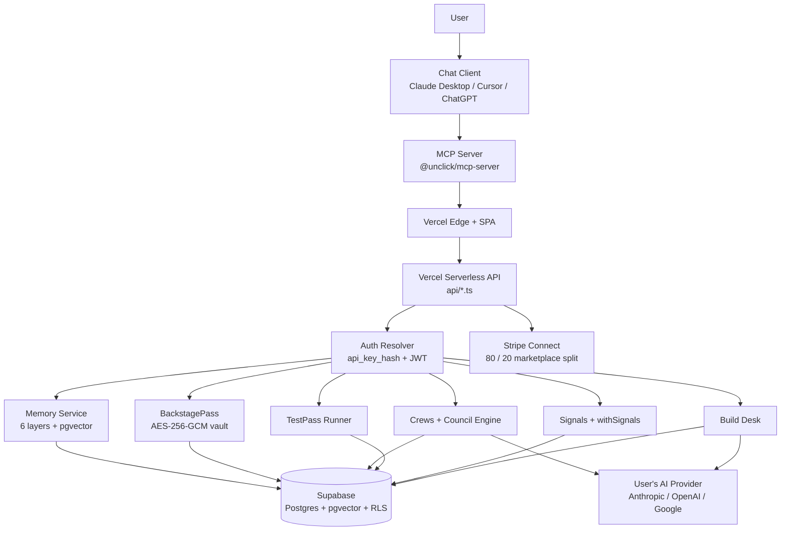

# UnClick Architecture Overview

## Elevator description

UnClick is the identity, memory, credentials, and economy layer every agent harness needs. One npm install gives an agent access to 450+ callable endpoints across 60+ integrations AND persistent cross-session memory, all via the MCP protocol. The user's own LLM chat client is the orchestrator; UnClick is the infrastructure that sits behind it. The platform follows the Stripe model (rails for the industry), not the Windows model (a competing OS), and bills only for platform features, never for LLM tokens.

---

## System diagram



Nodes: user, chat client, MCP server, Vercel Edge + SPA, serverless API, auth resolver, six product services (Memory, BackstagePass, Crews, TestPass, Signals, Build Desk), Supabase, the user's AI provider, and Stripe Connect. Thirteen boxes, every edge is a real wire in today's codebase.

---

## The 7 product pillars

1. **Memory.** Six layers (business context, sessions, facts, library, conversations, code), bi-temporal schema, hybrid retrieval via pgvector. Managed cloud default; BYOD escape hatch with AES-256-GCM encrypted service-role keys. Five direct MCP tools name the session protocol.
2. **BackstagePass.** Encrypted credential vault. AES-256-GCM at rest, PBKDF2 key derivation, proof-of-possession auth (JWT plus plaintext api_key, timing-safe compare), full audit log on every action.
3. **Crews.** Composable AI crews from agent personas (developer, researcher, writer, organiser). Council engine at `src/lib/crews/engine.ts` orchestrates runs; `mc_crew_runs` records input, output, tokens, and provenance.
4. **TestPass.** QA pack runner for MCP servers. YAML packs, probe runner, compliance reports, GitHub Action, visual run UI at `/admin/testpass`. Anti-stomp pack guards against tools tampering with memory.
5. **Signals.** Notifications hub with a shared `withSignals` wrapper applied at tool-wiring time. Every tool emits uniform signals for success, failure, and user-alert cases. Cron-dispatched delivery every minute.
6. **Build Desk (Agents).** Task and worker orchestration. Multi-backend workers (Claude Code, Codex, Cursor, Gemini CLI). Task composer UI at `src/pages/BuildDesk.tsx`. Every dispatch event is audited; completion is PR-gated.
7. **Marketplace.** Developer portal with Stripe Connect and 80/20 revenue split (developer 80, UnClick 20). Built but doors closed pending curation layer. TestPass compliance is the gate for listings.

---

## Tenant data flow

```
user creates account
    -> api_keys row: { user_id, email, key_hash, tier }
    -> api_key_hash = SHA-256(user's raw api_key)

every request (browser or MCP):
    Bearer token OR Supabase JWT
    -> resolveApiKeyHash / resolveSessionUser
    -> server-derives api_key_hash (never trusts client-supplied)
    -> TenantContext = { userId, apiKeyHash, tier, isAdmin }

every DB query:
    .eq("api_key_hash", tenant.apiKeyHash)  // manual filter, required
    + RLS policy on the table                // second layer
    -> scoped rows returned
```

The client never supplies `api_key_hash`. Two layers of enforcement: manual `.eq` filters in every service_role query plus Row Level Security policies on every user-scoped table. Either layer alone has a failure mode; both together give defence-in-depth. See [ADR-0004](../adr/0004-multi-tenant-via-api-key-hash.md) and `docs/security/policies.md` section 3.

---

## Deployment topology

- **Vercel** hosts the website SPA (Vite build) and the serverless functions under `api/`. The Hobby plan caps the function count at 12, which forces the `memory-admin.ts` god-handler pattern today. Phase 3 migrates to Hono-on-Vercel to lift that cap without re-platforming. Two Vercel cron schedules: `nightly_decay` at 04:00 UTC and `signals-dispatch` every minute.
- **Supabase** is the single database and auth provider. Postgres with pgvector for hybrid retrieval, RLS enabled on 31 user-scoped tables (Phase 3 closes the remaining gaps), Supabase Auth for magic-link and OAuth (Google, Microsoft, GitHub).
- **Cloudflare** is the CDN in front of the Vercel edge for the marketing pages and static assets.
- **GitHub** is the source of truth. `main` deploys via Vercel GitHub integration on push. Supabase migrations apply via the `apply-migrations` workflow.
- **Stripe Connect** handles marketplace payouts to developers at the 80/20 split when the marketplace opens.

---

## The three dev paths

- **Path 1: `@claude` GitHub comments.** For small in-place fixes. A user or reviewer comments `@claude` on an issue or PR; `claude.yml` triggers a Claude Code run against the cloud repo. Output is a direct commit or a small PR. Right size: one-line fixes, typo corrections, obvious null checks.
- **Path 2: Direct courier session.** For medium tasks that fit in a single chat. The developer pairs with Claude Code in their terminal. The cloud repo is the source of truth; the developer pushes when work is done. Right size: add a new MCP tool, wire a new API endpoint, ship a small feature.
- **Path 3: Vibe Kanban (VK) worktree routing.** For multi-chunk work. VK creates an isolated git worktree branch, runs the agent against it, and enforces a mandatory PR completion protocol. No agent pushes to `main` directly; every completed task raises a PR for human review. The worktree is ephemeral; the PR is the durable artefact. Right size: refactor the auth pipeline, build a new product pillar, any task that spans many turns and files. See [ADR-0009](../adr/0009-path-3-vibe-kanban-routing.md).

---

## How tools get added

1. **Handler.** Create `api/*-tool.ts` (or extend an existing action handler) with the Vercel handler and endpoint logic. Tenant context comes from `resolveApiKeyHash` / `resolveSessionUser`. Input is validated with a Zod schema.
2. **Wire.** Add the tool to `packages/mcp-server/src/tool-wiring.ts` with name, description, category, and endpoint mapping. The `withSignals` wrapper applies automatically at wiring time. See [ADR-0010](../adr/0010-bolt-on-signals-pattern.md).
3. **Surface.** Add a tile in `src/pages/tools/Tools.tsx` for the website marketplace grid.
4. **Compliance.** Every new tool gets a TestPass pack entry in `packages/testpass/` so the `testpass-pr-check.yml` CI check covers it.

No per-tool MCP registration is added to `server.ts`. The 450+ endpoints are reached through the meta-tools (`unclick_search`, `unclick_browse`, `unclick_tool_info`, `unclick_call`). The only direct MCP registrations are the five memory tools (`load_memory`, `save_session`, `save_fact`, `search_memory`, `save_identity`). This keeps the client-facing tool list readable and lets the catalog scale without per-tool plumbing. See [ADR-0001](../adr/0001-mcp-first-agent-protocol.md).

---

**End of overview.md.**
