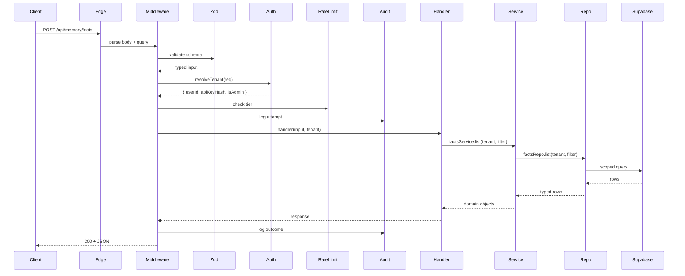

# UnClick - Target-State Architecture

**Phase 1 Ground Floor QC. Opinionated target design. Intended as the north star for Phases 2 through 7.**

This document describes the senior-dev-shaped UnClick. Each section cites the current-state pain it resolves (see [`current-state.md`](./current-state.md)) and the pattern it adopts. This is intentionally opinionated.

---

## 1. Shape of the monorepo

```
unclick/
├── apps/
│   ├── web/                    # React SPA (moved from repo root src/)
│   └── api/                    # Hono service (already exists; promoted to primary API)
├── packages/
│   ├── core/                   # @unclick/core - shared types, errors, response helpers
│   ├── types/                  # @unclick/types - DB row types + domain types (generated from Supabase)
│   ├── db/                     # @unclick/db - Supabase client factory + repositories
│   ├── crypto/                 # @unclick/crypto - PBKDF2 + AES-256-GCM helpers (single source)
│   ├── auth/                   # @unclick/auth - Bearer/JWT resolution, tenant resolver
│   ├── mcp-server/             # @unclick/mcp-server - the published npm package
│   ├── testpass/               # @unclick/testpass - QA runner
│   └── channel-plugin/         # @unclick/channel - local Claude Code heartbeat
├── services/                   # Business logic (not a package; app-internal)
│   └── …                       # (Deliberately app-internal; see section 3)
├── supabase/
│   └── migrations/             # Unchanged location; stricter naming (see section 5)
├── tests/
│   ├── unit/                   # Fast, parallel, mock-free
│   ├── integration/            # Real Supabase, ephemeral project
│   └── e2e/                    # Playwright
└── docs/
```

### Why this shape

- `apps/web` and `apps/api` are both first-class workspace apps. The root stops being "the website workspace **and** the monorepo root" (current-state section 1).
- A dedicated `packages/types` package holds the types that are currently duplicated 10 times (current-state section 10). Generated from `supabase gen types typescript` + hand-written domain unions.
- `packages/crypto` consolidates the three copies of the PBKDF2 + AES-256-GCM helpers (current-state section 8, observation 4). Security-critical code lives in exactly one place with a single test suite.
- `packages/auth` centralises `resolveApiKeyHash` / `resolveSessionUser` / `resolveSessionTenant` so every handler gets the same two-layer check.
- `packages/db` is a **repositories** package (see section 4). It enforces tenant scoping via the type system so no handler can ship a query that forgets `.eq("api_key_hash", hash)`.

---

## 2. API surface redesign

### 2.1 Principles

1. **One endpoint, one concern.** `api/memory-admin.ts` (5,401 LOC, 92 actions) becomes many small route handlers.
2. **No god switch.** Replace action-in-query with path-based routing (`/api/memory/facts`, `/api/admin/crews/runs/:id`).
3. **Validation at the edge.** Every handler declares a Zod schema for body + query; no handler executes business logic on unvalidated input.
4. **Handlers are thin.** A handler does: parse Zod -> resolve tenant -> call a service -> shape response. No SQL in handlers.
5. **Uniform error shape.** Errors go through `@unclick/core` error types -> JSON problem details.

### 2.2 Decomposition of `memory-admin.ts`

Split the 92 actions into **8 route groups** on disk (`apps/api/src/routes/**` or `api/{group}/{action}.ts` depending on the runtime choice in section 2.3):

| Group | Example routes | Sources today |
|---|---|---|
| `memory/` | `facts.ts`, `sessions.ts`, `library.ts`, `conversations.ts`, `code.ts`, `business-context.ts`, `clear-all.ts`, `export.ts`, `search.ts` | `status`, `facts`, `sessions`, `library*`, `conversations`, `code`, `search`, `delete_fact`, `delete_session`, `admin_clear_all`, `admin_export_all`, `update_business_context`, `admin_update_fact`, `admin_fact_add`, `admin_context_apply_template`. |
| `setup/` | `byod.ts`, `config.ts`, `disconnect.ts`, `status.ts`, `generate-config.ts` | `setup`, `setup_status`, `disconnect`, `config`, `admin_generate_config`. |
| `devices/` | `heartbeat.ts`, `list.ts`, `revoke.ts` | `device_check`, `list_devices`, `auth_device_list`, `auth_device_revoke`, `remove_device`. |
| `tools/` | `detect.ts`, `list.ts`, `scan.ts`, `dismiss-nudge.ts`, `conflicts/` (check, detect, dismiss, resolve) | `admin_tools`, `admin_tool_scan`, `tool_detect`, `dismiss_tool_nudge`, `conflict_*`. |
| `agents/` | `list.ts`, `get.ts`, `create.ts`, `update.ts`, `delete.ts`, `duplicate.ts`, `clone.ts`, `tools.ts`, `memory-scope.ts`, `activity.ts`, `resolve.ts` | all `admin_agent_*` + `list_agents`, `clone_agent`, `create_agent`, `update_agent`. |
| `crews/` | `catalog/`, `runs/` (list, get, start) | `list_crews`, `create_crew`, `update_crew`, `delete_crew`, `start_crew_run`, `list_runs`, `get_run`. |
| `testpass/` | `packs/`, `runs/` (list, get, start) | `list_testpass_*`, `get_testpass_run`, `start_testpass_run`. |
| `signals/` | `list.ts`, `check.ts`, `mark-read.ts`, `preferences.ts` | all `*_signals`, `check_signals`, `*_signal_preferences`. |
| `channel/` | `send.ts`, `poll.ts`, `status.ts`, `heartbeat.ts`, `ai-chat.ts` | all `admin_channel_*`, `admin_ai_chat`. |
| `build-desk/` | `tasks/`, `workers/`, `dispatch/` | `admin_build_tasks` (nested), `admin_build_workers` (nested), `admin_build_dispatch`. |
| `account/` | `profile.ts`, `api-key/generate.ts`, `api-key/reset.ts`, `delete.ts` | `admin_profile`, `generate_api_key`, `reset_api_key`, `delete_account`. |
| `cron/` | `nightly-decay.ts`, `signals-dispatch.ts` | `nightly_decay`, existing `signals-dispatch.ts`. |
| `tenant/` | `settings.ts`, `autoload-settings.ts`, `bug-reports.ts`, `memory-load-event.ts`, `setup-guide.ts`, `health.ts` | `tenant_settings*`, `admin_get_setup_guide`, `log_tool_event`, `admin_bug_reports`, `health_summary`, `admin_memory_load_metrics`, `admin_missed_context_alerts`, `admin_check_connection`. |

### 2.3 Runtime choice

Two realistic paths:

**Path A (recommended): finish the Hono migration.** `apps/api/` already exists with a rate-limited Hono service. Route the above group structure into Hono, deploy as a Cloudflare Worker **or** as a single Vercel function that mounts the Hono app (so we keep Vercel deploys). Reasons:
- Single cold-start instead of 22+ per-file cold-starts.
- One middleware pipeline (tenant resolution, rate limit, audit, CORS) for all routes.
- Consistent error handling via Hono's `onError`.
- Rate limiter already written (`apps/api/src/middleware/rate-limit.ts`).

**Path B: keep Vercel file-per-function but factor aggressively.** Each file becomes a thin wrapper: `export default handle(schema, handler)` where `handle` pulls from `packages/auth` and `packages/core`. This keeps the Vercel model but removes the god switch. Works; costs us unified middleware.

Target: Path A, with a compatibility shim that keeps legacy query-action URLs working for two releases.

### 2.4 Request lifecycle



Every step is testable in isolation. Every destructive action writes to the audit store via the middleware, **not** inside the handler.

---

## 3. Service layer

Services encapsulate business rules. They depend on repositories (section 4) and shared packages. They do not import Supabase directly.

### 3.1 Inventory

| Service | Lives at | Responsibilities |
|---|---|---|
| `MemoryService` | `apps/api/src/services/memory.service.ts` | Fact/session/library/conversation/code CRUD, embeddings, search, decay. |
| `MemorySetupService` | `apps/api/src/services/memory-setup.service.ts` | BYOD validation, schema install via exec_sql RPC, encrypted credential storage. |
| `DeviceService` | `.../device.service.ts` | Multi-device pairing, heartbeat, nudge logic. |
| `ToolDetectionService` | `.../tool-detection.service.ts` | Competing MCP detection, nudges, conflict resolution. |
| `AgentService` | `.../agent.service.ts` | Agent CRUD, system-agent cloning, memory scope management. |
| `CrewService` | `.../crew.service.ts` | Crew CRUD, run orchestration, calls council engine. |
| `TestPassService` | `.../testpass.service.ts` | Pack CRUD, run orchestration, reporter streaming. |
| `SignalsService` | `.../signals.service.ts` | Signal fan-out, preferences, mark-read. |
| `ChannelService` | `.../channel.service.ts` | Local Claude Code heartbeat + message routing; Gemini fallback. |
| `BuildDeskService` | `.../build-desk.service.ts` | Task/worker registry, dispatch. |
| `AccountService` | `.../account.service.ts` | API key lifecycle, profile, **delete account (only place this logic lives)**. |
| `AuditService` | `.../audit.service.ts` | Single entry point for all audit writes. Ensures every destructive op logs. |
| `CouncilEngine` | `packages/engine/src/council.ts` | **Moved out of `src/lib/crews/engine.ts`** - no more API-reaches-into-SPA import. |

### 3.2 Service rules

1. Services receive a `TenantContext` as their first argument (typed: `{ apiKeyHash, userId, tier, isAdmin }`). They never re-derive it.
2. Services call repositories, not Supabase clients, for row CRUD. They may call the Supabase **auth admin** client (injected) for `auth.admin.deleteUser`.
3. Destructive operations take a `logContext: AuditLogContext` and call `AuditService.record(...)` before and after the mutation.
4. Services are pure-business where possible; any AI-SDK call lives in an injected adapter.

---

## 4. Repository layer

One repository file per user-scoped table. This is where tenancy enforcement moves from ad-hoc `.eq("api_key_hash", hash)` calls into the type system.

### 4.1 Shape

```ts
// packages/db/src/repositories/facts.repo.ts
import { tenantScoped, TenantContext } from "../scoped";

export const factsRepo = {
  list: tenantScoped(async (db, tenant: TenantContext, filter: FactsFilter) => {
    return db.from("mc_extracted_facts")
      .select("*")
      .eq("api_key_hash", tenant.apiKeyHash)   // Enforced by tenantScoped wrapper
      .match(filter.match ?? {})
      .order("created_at", { ascending: false })
      .limit(filter.limit ?? 100);
  }),
  insert: tenantScoped(async (db, tenant, row: FactInsert) => {
    return db.from("mc_extracted_facts").insert({ ...row, api_key_hash: tenant.apiKeyHash });
  }),
  // update, delete, etc.
};
```

`tenantScoped(fn)` is a higher-order wrapper that:
- Requires `tenant.apiKeyHash` (typed `string`, not `string | undefined`).
- Injects an audit context into any mutation.
- Runs in a single DB "session" that sets a Postgres `session_user` variable so RLS policies can additionally verify.

### 4.2 Per-table repositories

```
packages/db/src/repositories/
├── api-keys.repo.ts
├── facts.repo.ts                # mc_extracted_facts
├── sessions.repo.ts             # mc_session_summaries
├── library.repo.ts              # mc_knowledge_library + _history + mc_canonical_docs
├── conversations.repo.ts        # mc_conversation_log
├── code.repo.ts                 # mc_code_dumps
├── business-context.repo.ts     # mc_business_context
├── memory-configs.repo.ts       # memory_configs (BYOD)
├── memory-devices.repo.ts       # memory_devices
├── auth-devices.repo.ts         # auth_devices
├── agents.repo.ts               # agents + mc_agents
├── crews.repo.ts                # mc_crews + mc_crew_runs
├── testpass.repo.ts             # testpass_packs + testpass_runs
├── signals.repo.ts              # mc_signals + mc_signal_preferences
├── build-desk.repo.ts           # build_tasks + build_workers + build_dispatch_events
├── credentials.repo.ts          # user_credentials (BackstagePass vault)
├── tool-detection.repo.ts       # tool_detections + conflict_detections
├── tenant-settings.repo.ts      # tenant_settings
├── metering.repo.ts             # metering_events
├── audit.repo.ts                # backstagepass_audit + account_deletions_audit + facts_audit + mc_facts_audit
└── platforms.repo.ts            # platform_connectors + platform_credentials
```

### 4.3 Why this is the right level of abstraction

- Repositories are tiny (often <50 LOC each). They are not a Java-style anti-pattern because they carry meaningful rules: tenancy, audit injection, type narrowing.
- Services compose multiple repos when needed (e.g. `AccountService.deleteAccount` calls 15 repos in a coordinated sequence).
- Handlers only see services - they cannot accidentally bypass tenancy.

---

## 5. Database and migrations

### 5.1 Clean up duplicate migrations

Current duplicates documented in current-state section 9. Target:

- Consolidate the six `20260418000000_*` migrations into a single linearly-named set (`20260418000100`, `..000200`, ...).
- Drop the duplicate `tenant_settings`, `agents`, `conflict_detections`, `tool_detections`, `memory_load_events` creation migrations; keep one canonical source.
- Rename all future migrations to a strict `YYYYMMDD_HHMMSS` (with an underscore) to make the dividing point between date and time unambiguous.

### 5.2 RLS coverage

Target: **every user-scoped table has RLS enabled with at least two policies** (service_role bypass + either user-filtered read or a "no direct access" deny).

Gaps to close (current-state section 6):
- `memory_configs` - critical, encrypted service-role keys at rest.
- `memory_devices`.
- `build_tasks`, `build_workers`, `build_dispatch_events`.
- `memory_load_events`.
- `tenant_settings`.
- `conflict_detections`, `tool_detections`.
- `bug_reports`.
- `mc_agents`, `mc_crews`, `mc_crew_runs` (verify / enable if missing).

### 5.3 Audit tables as first-class

Promote the audit surface:
- All destructive mutations write to `audit_events` (one unified table) with JSON payload + table + row_id + tenant + actor.
- Keep `backstagepass_audit` and `account_deletions_audit` as specialized read-optimised views over `audit_events`.

---

## 6. Shared types package

`packages/types/` becomes the single source of truth for domain types.

### 6.1 Structure

```
packages/types/
├── src/
│   ├── supabase.ts          # Generated: supabase gen types typescript
│   ├── domain/
│   │   ├── user.ts
│   │   ├── fact.ts
│   │   ├── session.ts
│   │   ├── agent.ts
│   │   ├── crew.ts
│   │   ├── credential.ts
│   │   ├── signal.ts
│   │   ├── tool.ts
│   │   └── tenant.ts        # TenantContext, ApiKeyHash branded type
│   └── index.ts
└── package.json
```

Rules:
- DB row types come from generated `supabase.ts` - never hand-written.
- Domain types (what the UI and services use) are thin wrappers with stable shapes that do not change when we reshape the DB.
- `packages/types` depends on nothing (zero runtime imports); it is pure `.d.ts`.
- All packages and apps import from `@unclick/types`. No local `interface Fact { ... }` declarations allowed outside this package.

---

## 7. Frontend restructure

Current: `src/pages/*.tsx` with 29 top-level pages and a few nested admin folders.

Target: feature-folder pattern under `apps/web/src/features/`.

```
apps/web/src/
├── app/
│   ├── App.tsx                 # Router composition, TanStack Query provider
│   └── routes.tsx              # Route table (still declared once, but imports features)
├── features/
│   ├── memory/                 # /memory, /memory/setup, /memory/connect, /memory/setup-guide
│   │   ├── pages/
│   │   ├── components/
│   │   ├── hooks/
│   │   └── api.ts              # TanStack Query hooks calling /api/memory/*
│   ├── arena/
│   ├── developers/
│   ├── crews/
│   ├── testpass/
│   ├── signals/
│   ├── admin/                  # The /admin/* shell and its surfaces
│   ├── backstagepass/
│   ├── connect/
│   ├── build-desk/
│   ├── marketing/              # /, /pricing, /terms, /privacy, /smarthome, /new-to-ai
│   └── auth/                   # /login, /signup, /auth/callback, /auth/verify-mfa
├── shared/
│   ├── components/             # Design-system atoms (Radix wrappers, Toaster, etc.)
│   ├── hooks/
│   └── lib/                    # supabase client, posthog, analytics
└── styles/
```

Rules:
- Each feature owns its pages, components, hooks, and API client.
- No cross-feature imports except through `shared/` or exported `api.ts` hooks.
- TanStack Query is the data layer; no `useEffect(fetch)` in pages.

### 7.1 Component size budget

Any page/component over 300 LOC gets a PR review comment. Current offenders from current-state section 9:
- `DeveloperDocs.tsx` (632) -> split into `<InstallGuide>`, `<ConfigGenerator>`, `<ToolHealthCheck>`.
- `Tools.tsx` (571) -> extract `<ToolSearch>`, `<ToolGrid>`, `<CategoryTabs>`.
- `Connect.tsx` (547) -> one flow per platform under `features/connect/platforms/<name>/`.
- `SmartHome.tsx` (541) -> marketing content to MDX.
- `MemorySetup.tsx` (504), `MemoryConnect.tsx` (503) -> wizard stepper with per-step components.

---

## 8. CI/CD target state

### 8.1 Pipelines

| Trigger | Stages | Notes |
|---|---|---|
| PR opened | lint -> typecheck -> unit tests -> build -> e2e smoke on preview deploy -> TestPass -> security scan | Full matrix on each push. Required before merge. |
| Push to `main` | promote preview -> prod; apply migrations via signed GitHub Action; post-deploy smoke | Already mostly in place; add post-deploy check. |
| Nightly | npm audit (fail on new High/Critical) -> full TestPass across all packs -> supabase-schema drift check | Surfaces drift and new CVEs within a day. |
| Weekly | dependency graph + bundle size report -> stale branches cleanup | Keeps the codebase honest. |

### 8.2 Branch protection

- `main` is protected: linear history, required checks (lint, typecheck, unit, e2e, TestPass, security scan), at least one review.
- Docs-only PRs bypass e2e via a `docs-only` path-filter on the workflow.

### 8.3 Secrets rotation

- Stripe + Supabase service role keys rotated quarterly via GitHub Environments.
- GitHub push protection (secret scanning) is on. CI fails if a secret-like pattern appears in a diff.

---

## 9. Testing strategy

### 9.1 What to test

| Layer | What to test | What not to test |
|---|---|---|
| Repositories | Tenant scoping is enforced; SQL is well-formed. | Supabase internals. |
| Services | Business rules, ordering, audit emission. | Repo implementation. |
| Handlers | Zod schema, status codes, happy + 4xx paths. | Service logic. |
| Crypto package | Known-answer tests vs. OpenSSL. Round-trip. Tampered-tag rejection. | - |
| Council engine | Prompts are well-formed; timeouts and token budgets respected. | Real model calls (mock the SDK). |
| Frontend features | Route renders; forms submit; TanStack Query happy-path. | Pixel-perfect snapshots. |
| e2e | Signup -> generate API key -> save fact -> recall fact -> delete account -> confirm audit. BackstagePass add/reveal/delete. | Every route permutation. |
| TestPass | Run each published pack against a staging MCP server. | - |

### 9.2 Target coverage

- Crypto and auth packages: **100% branch coverage**.
- Services: 80% line coverage, 100% on destructive paths.
- Handlers: 100% schema-level + happy path + each 4xx branch.
- Frontend: 70% line coverage on features/, 100% on `admin/`.
- e2e: 6 golden flows covered.

No percentage targets for "anything else"; we do not chase coverage numbers for their own sake.

### 9.3 What not to test

- Generated types.
- Supabase row filtering (trust the DB).
- Pure-display marketing components.
- Radix primitive behaviour.

---

## 10. Migration strategy (how we get from current to target)

### Phase 2: Foundations (weeks 1-2)
1. Create `packages/types` with Supabase-generated types. Ban new local `interface`s via ESLint rule.
2. Create `packages/crypto`. Migrate all three call sites. Delete duplicated copies.
3. Create `packages/auth` with `resolveApiKeyHash` / `resolveSessionUser` / `resolveSessionTenant`. Migrate all handlers to use it.

### Phase 3: Security fixes (week 3) - block Phase 4+ if not complete
1. Add RLS to `memory_configs`, `memory_devices`, `build_*`, `memory_load_events`, `tenant_settings`, `conflict_detections`, `tool_detections`. See [`../security/current-posture.md`](../security/current-posture.md).
2. Remove `?api_key=...` query-param auth from `setup_status`, `conflict_check`, `health_summary`.
3. Add audit logging to all destructive writes (especially `admin_clear_all`).
4. Scope the `admin_tools` read of `platform_connectors`.
5. Run `npm audit fix`. Plan major-version upgrades for drizzle-orm, @vercel/node, react-router.
6. Add security headers (CSP, X-Frame-Options, X-Content-Type-Options, HSTS) via `vercel.json` or Hono middleware.

### Phase 4: Repositories + Services (weeks 4-5)
1. Create `packages/db` repositories, one at a time, behind a feature flag.
2. Introduce services in `apps/api/src/services/`. Start with AccountService (highest risk) and MemoryService (highest volume).
3. Each service migration PR moves 5-10 actions out of `memory-admin.ts` at a time.

### Phase 5: Decompose `memory-admin.ts` (weeks 6-8)
1. Route group by route group (section 2.2), ship behind a compatibility shim that maps old `?action=` URLs to new paths.
2. Delete the corresponding switch case in `memory-admin.ts` only after the shim routes traffic to the new handler.
3. Final PR deletes `memory-admin.ts` and the compatibility shim when traffic is zero.

### Phase 6: Frontend feature folders (weeks 9-10)
1. Move pages feature-by-feature from `src/pages/` to `apps/web/src/features/`.
2. Extract oversized components during the move; do not defer.
3. Replace ad-hoc `fetch()` calls with TanStack Query hooks.

### Phase 7: CI/CD + observability (week 11)
1. Wire the pipelines in section 8.
2. Add OpenTelemetry traces across services.
3. Add per-tenant rate limits at the edge (Hono middleware).

### Non-goals for this refactor
- Rewriting `tool-wiring.ts`. The 447KB file is ugly but works; it can be code-generated from a manifest in a separate project.
- Moving off Vercel (only if the Hono-on-Vercel adapter wins, otherwise we re-platform to Cloudflare in a separate project).
- Kubernetes, Docker, or any self-hosting path.

---

## 11. What we are not changing

- The **tenancy model**: `api_key_hash`-scoped. It works and the two-layer JWT-to-api_key lookup is sound.
- The **6-layer memory architecture**: business context, sessions, facts, library, conversations, code. It maps to real agent workflows.
- The **MCP-first surface**: 5 direct memory tools + `unclick_search` meta-tool. Published npm package stays stable for end users.
- **BYOD setup**: user-supplied Supabase + encrypted service-role key. This is a differentiator.
- **Vercel serverless** for the frontend deploy (`vite build`). Only the `/api/*` surface moves to Hono.

---

## 12. Patterns cited

- **Repository pattern** (Fowler / Evans): thin per-table wrappers that enforce invariants at the type level.
- **Service layer** (Fowler): business logic isolated from transport and persistence.
- **Feature-folder frontend** (Bulletproof React, Vercel Next.js app-router docs): colocate pages, components, hooks, and API clients by feature.
- **Hexagonal / ports-and-adapters** (Cockburn): services own interfaces; repositories and AI SDK clients are adapters.
- **Edge-validated input** (tRPC, Hono+Zod): Zod schemas at the boundary guarantee internal types.
- **Branded types** (TypeScript idiom): `ApiKeyHash = string & { readonly __brand: unique symbol }` prevents mixing a user-supplied string with a verified one.
- **Generated DB types** (supabase-js + `supabase gen types typescript`): DB is the source of truth.

---

**End of target-state.md.**
