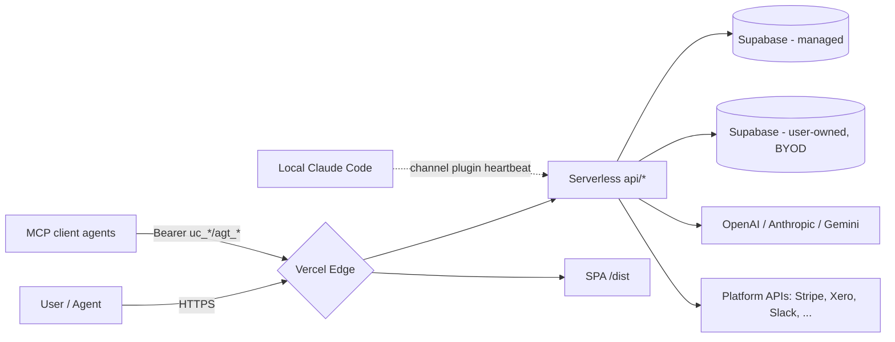

# UnClick - Threat Model

**Phase 1 Ground Floor QC. STRIDE threat model plus UnClick-specific scenarios. Generated 2026-04-24.**

Every threat below is concrete: it names the file(s) or migration(s) where the mitigation lives (or should live) and grades the residual gap. See [`current-posture.md`](./current-posture.md) for the evidence behind each claim.

---

## Trust boundaries

Boundaries we trust:
- Supabase managed project (our hosted DB).
- Vercel serverless runtime.
- PostgreSQL RLS where enabled.

Boundaries we do **not** trust (any input crossing them is untrusted):
- Browser-supplied Bearer tokens, bodies, query strings.
- MCP clients (agents), even from honest users - they execute LLM output.
- OAuth redirect traffic from third-party providers.
- BYOD Supabase projects (user-owned; we hold encrypted credentials for them).
- AI model output (treated as potentially adversarial text).

---

## STRIDE

### S - Spoofing

| Threat | Current mitigation | Gap | Priority |
|---|---|---|---|
| Forged API key presented as another user's. | API keys stored as SHA-256 hash in `api_keys` table (`20260410100000_keychain_mvp.sql`); raw key never stored. Bearer path in `api/memory-admin.ts:357-391` rejects non-`uc_/agt_` prefixes before hashing. | None material. | Low |
| Replayed Supabase session JWT from a previous user's localStorage. | `resolveSessionUser()` (`api/memory-admin.ts:218-242`) calls `supabase.auth.getUser(token)` to validate JWT server-side, then re-derives `api_key_hash` from `api_keys` by `user_id`. Client-supplied hash is never trusted. | None material. | Low |
| Admin spoofing (non-admin claims admin). | `ADMIN_EMAILS` env var checked in `api/admin-users.ts:29-37` and `api/memory-admin.ts#admin_profile`. Frontend `<RequireAdmin>` additionally hides the UI. | None material. | Low |
| OAuth callback replay / state CSRF. | State token "validated client-side" per `api/oauth-callback.ts:11` docstring. | **Server-side state verification is missing.** A crafted callback can be replayed from a different session. | **Med** |
| Channel-plugin spoofing: a remote attacker pretends to be the user's local Claude Code. | `chat_messages` + `channel_status` are RLS-restricted to `service_role` only (`20260418000000_channels_orchestrator.sql`). Channel plugin authenticates with the user's api_key. | If the api_key leaks, an attacker can impersonate the channel and inject chat responses. Mitigated by API key being per-tenant. | Low |

### T - Tampering

| Threat | Current mitigation | Gap | Priority |
|---|---|---|---|
| Tampering with stored facts or memory rows. | RLS on `mc_*` tables blocks direct client access; serverless layer always filters by `api_key_hash`. Bitemporal columns (`valid_from`, `valid_to`) + `mc_facts_audit` record provenance (`20260422010000_memory_bitemporal_and_provenance.sql`). | `memory_configs`, `memory_devices`, `build_*`, `memory_load_events`, `tenant_settings`, `conflict_detections`, `tool_detections` have **no RLS** (see current-posture C1). | **High** |
| Tampering with audit records. | `backstagepass_audit` is append-only; RLS restricts writes to service_role. | No cryptographic chaining or external log sink; a DB admin could still erase rows. | Med |
| Tampering with encrypted service-role keys at rest. | AES-256-GCM with PBKDF2 per-row salt (`api/memory-admin.ts:106-130`, `api/backstagepass.ts:63-88`). Auth tag verified on decrypt. | `memory_configs` lacks RLS (see C1). Crypto primitive is sound; storage access control is not. | **High** |
| SQL injection via user-supplied filters. | All Supabase queries use `.eq()` / `.in()` parameterised builders (no raw SQL). | `drizzle-orm < 0.45.2` (used in `apps/api`) has a High-severity SQL-injection CVE via improperly escaped identifiers (GHSA-gpj5-g38j-94v9). | **High** |
| Tampering with cron invocations (`nightly_decay`). | `CRON_SECRET` Bearer required; request fails closed if env var unset (`api/memory-admin.ts:4063-4076`). | None material. | Low |

### R - Repudiation

| Threat | Current mitigation | Gap | Priority |
|---|---|---|---|
| User denies deleting their account. | `account_deletions_audit` row inserted before cascade, including email, api_key_hash, reason, rows deleted, partial_failure flag (`api/memory-admin.ts:3471`). | None material. | Low |
| User denies wiping their memory via `admin_clear_all`. | **No audit record is written** (see C2). | Full repudiation possible today. | **High** |
| User denies individual fact / session / library deletions. | No per-delete audit row (`delete_fact`, `delete_session`, etc.). | Must recover from bitemporal history; not a formal audit trail. | Med |
| Agent denies a crew run outcome. | `mc_crew_runs` records input + output + token budget per run (`20260423000000_crews_phase_b.sql`). `agent_trace` records individual model + tool invocations. | None material, though no append-only constraint. | Low |
| Developer denies submitting a bad tool. | `bug_reports` + Developer submission tables include `api_key_hash`; Stripe onboarding records `developer_id`. | Submission audit surface unverified; `bug_reports` RLS status unclear. | Med |

### I - Information disclosure

| Threat | Current mitigation | Gap | Priority |
|---|---|---|---|
| Cross-tenant read of memory rows. | Every `api/memory-admin.ts` query filters by `api_key_hash`. RLS on `mc_*` tables blocks direct access. | One known leak: `admin_tools` reads `platform_connectors` without scoping (see C3). | **High** |
| Credential leak from `user_credentials` / BackstagePass. | AES-256-GCM at rest, PBKDF2 key derivation, `block_anon_access` + `block_authenticated_direct_access` RLS policies, service_role only. `api/backstagepass.ts` reveal requires JWT **and** plaintext api_key (timing-safe compare). | None material. | Low |
| BYOD service-role key disclosure. | Encrypted in `memory_configs`. | `memory_configs` has no RLS (C1). Storage defence-in-depth missing. | **High** |
| Query-string leak of api_key. | Three actions accept `?api_key=...` (`setup_status`, `conflict_check`, `health_summary`). | URLs are logged by Vercel, CDNs, browsers, referrers. | Med |
| Information disclosure via error messages. | Most handlers return `{ error: "..." }` with generic messages. | Not audited exhaustively; some DB errors may surface Postgres messages. | Low |
| Bundle-size inference attacks (timing / size of response). | Responses are not padded. | Unlikely to be practical; note for completeness. | Low |
| Prompt exfiltration (LLM leaks other-tenant data). | Model calls only receive the current tenant's content; no cross-tenant data in context. | If the memory index is ever queried without tenant filter (a bug or migration), model output can leak across tenants. | Med |
| OAuth token leak via access logs. | OAuth callback is POST with body payload, not GET. Tokens stored via `api/credentials.ts` encrypted at rest. | Referrer leakage on error pages not audited. | Low |

### D - Denial of service

| Threat | Current mitigation | Gap | Priority |
|---|---|---|---|
| Request flooding of Vercel serverless endpoints. | **None on Vercel.** Hono service has `apps/api/src/middleware/rate-limit.ts` but is not in the production path. | Any authenticated user can spam `delete_fact`, `setup`, `generate_api_key`, `admin_ai_chat` at unbounded rates. | **High** |
| Unauthenticated flood of public endpoints (`api/arena`, `api/mcp`, `api/report-bug`). | Vercel platform burst protection. | No application-level limit. | Med |
| Computationally expensive BYOD `setup`: user-provided Supabase URL can point to a slow target. | No timeout on the ping + install step (`api/memory-admin.ts:2052-2059`). | A slow BYOD project could hold a function open until Vercel timeout. | Low |
| `admin_ai_chat` / crew run token exhaustion. | Token budget enforced on `mc_crew_runs` (`20260423000000_crews_phase_b.sql`). | No per-tenant daily cap on Gemini fallback usage. | Med |
| Undici HTTP smuggling / unbounded decompression. | - | **High-severity CVE** in undici <=6.23.0 (pulled via @vercel/node); see current-posture C4. | **High** |
| `brace-expansion` / `flatted` prototype-pollution or parse-bomb DoS. | - | Moderate and High CVEs in `flatted`, `brace-expansion` (current-posture C4). | Med |

### E - Elevation of privilege

| Threat | Current mitigation | Gap | Priority |
|---|---|---|---|
| Authenticated user gains admin access. | `ADMIN_EMAILS` env var at runtime + `<RequireAdmin>` on the frontend. | `ADMIN_EMAILS` is an env var; rotation requires a redeploy. | Low |
| Non-admin reaches admin-only endpoints by guessing URLs. | Every admin action checks `ADMIN_EMAILS` server-side. | Not all checks audited exhaustively; recommend spot test. | Med |
| User modifies their own api_key tier to bypass paywall. | `api_keys.tier` is server-written only; `generate_api_key` sets tier based on server-side policy (Stripe webhook integration). | Stripe webhook validation not reviewed in this audit. | Med |
| BYOD project compromise escalates to managed-cloud write. | Services use their own Supabase client; BYOD credentials are only used for the user's own project operations. | If a handler ever mixes the clients, an attacker-controlled Supabase could echo back malicious responses. | Low |
| Drizzle ORM SQL injection CVE allows privilege escalation. | - | **High** (GHSA-gpj5-g38j-94v9). See C4. | **High** |

---

## UnClick-specific scenarios

### UC-1. Cross-tenant data leak (2026-04-22 near-miss)

**Scenario**: A query in an admin path returns a row from tenant B while authenticated as tenant A.

**Is it really closed?**
- The April 22 near-miss (per session history and the bitemporal migration) was in the facts read path. That path now filters by `api_key_hash` on every query, and `mc_facts_audit` records all mutations.
- But the **class of bug** is not closed structurally. The current repo has at least one active instance: `admin_tools` reads `platform_connectors` without a filter (C3). Without the repository-layer enforcement proposed in [target-state.md section 4](../architecture/target-state.md#4-repository-layer), the next unfiltered query is only a code review away.

**Priority**: **High** until repository-layer enforcement ships.

### UC-2. Leaked API key blast radius

**Scenario**: A user pastes their `uc_*` key into a public gist / bad MCP config / compromised machine.

**Current blast radius**:
- Full read/write of that tenant's memory (all 6 layers).
- Full read/write of their agents, crews, signals, BackstagePass credentials.
- Ability to rotate the api_key (`reset_api_key`) - locks the legitimate user out.
- Ability to initiate `delete_account` **but** that requires the Supabase JWT, not just the api_key. So a leaked api_key cannot delete the account. Good.
- `admin_clear_all` only requires the api_key Bearer. So a leaked key **can** nuke memory without re-auth. Not good.

**Mitigations in place**:
- Keys are per-tenant, not per-device. Revocation via `reset_api_key` (user-initiated).
- SHA-256 hash stored; raw key never persisted.
- Keys are prefixed (`uc_`, `agt_`) for easy scanning (GitHub secret scanning can find them if push protection is on).

**Gaps**:
- No automatic anomaly detection (e.g. 1000 RPS from a key triggers a soft-lock).
- No IP allow-listing per api_key.
- `admin_clear_all` does not require a second factor.

**Priority**: Med.

### UC-3. Compromised developer account

**Scenario**: Chris's GitHub / Supabase / Vercel account is compromised.

**Mitigations in place**:
- GitHub push protection should be on at the repo level (confirm).
- Supabase service-role key rotation is supported.
- Vercel project linked to GitHub via per-project token.

**Gaps**:
- 2FA status per service not confirmed in this audit.
- Secret rotation cadence not documented.
- No emergency break-glass procedure ("if main is compromised, run X to freeze production").

**Priority**: **High** (human-level risk, low-cost mitigations).

### UC-4. Malicious MCP server attacking UnClick via prompt injection

**Scenario**: A user installs a third-party MCP server that, when an agent calls a tool on it, returns a prompt-injection payload. The agent then calls `save_fact` with crafted content that manipulates a future session.

**Mitigations in place**:
- Fact text is truncated to 4000 chars before embedding (`packages/mcp-server/src/memory/supabase.ts:50`).
- No tool on UnClick's side executes shell commands based on fact text.
- `save_fact` writes to `mc_extracted_facts` scoped to the calling tenant.

**Gaps**:
- Agents re-read facts on future `load_memory` calls. A planted fact can instruct a future agent.
- No content classification on save_fact (e.g. "this fact looks like a jailbreak prompt").
- Conflict detection (`tool_detections`, `conflict_detections`) tracks installed tools but doesn't grade them for trust.

**Priority**: Med.

### UC-5. DDoS via public API endpoints

**Scenario**: Attacker spams `/api/arena` (read-only, public), `/api/mcp` (discovery), `/api/report-bug`, `/api/signals-dispatch` cron endpoint.

**Mitigations in place**:
- Vercel edge burst protection (platform-level).
- `/api/signals-dispatch` is a cron endpoint; attacker can hit it but it performs idempotent work.
- Public arena endpoints are read-only.

**Gaps**:
- No application rate limit on the Vercel surface (see STRIDE-D). An attacker can spend our Supabase budget and Vercel function-invocation budget cheaply.

**Priority**: **High**.

### UC-6. Credential theft via BackstagePass

**Scenario**: Attacker tries to reveal or exfiltrate BackstagePass vault contents.

**Mitigations in place** (`api/backstagepass.ts`):
- Reveal requires **both** Supabase JWT and plaintext `api_key` in the body (timing-safe compare, `api/backstagepass.ts:70-84`).
- Credentials encrypted at rest with AES-256-GCM + PBKDF2 (per-row salt).
- `user_credentials` has `block_anon_access` + `block_authenticated_direct_access` RLS.
- Every action (list / reveal / update / delete) writes `backstagepass_audit`.
- Frontend CORS restricted to `https://unclick.world`.

**Gaps**:
- No multi-factor confirmation on reveal (a stolen session + stolen api_key = vault access).
- No time-window limit on how often the same credential can be revealed.
- No alerting on unusual reveal patterns (e.g. revealing 50 credentials in 10 seconds).

**Priority**: Med (strong-by-default; enhancements would harden further).

### UC-7. Cron-abuse via `nightly_decay`

**Scenario**: Attacker discovers the `CRON_SECRET` and forces memory decay passes against every tenant repeatedly.

**Mitigations in place**:
- `CRON_SECRET` Bearer required; fail-closed if env var unset.
- Decay RPC (`mc_manage_decay`) is idempotent.

**Gaps**:
- If the secret leaks, attacker can run decay at arbitrary cadence. Not data-destructive (decay is tier-based downgrade) but increases DB load.

**Priority**: Low.

---

## Top 5 security priorities for Phase 3-5

Sorted by impact × feasibility. These are the items to resolve in Phase 3 before any Phase 4+ refactor work.

### 1. Enable RLS on `memory_configs` and `memory_devices` (Phase 3)
**Impact**: Closes the most serious defence-in-depth gap. `memory_configs` holds encrypted service-role keys.
**Effort**: One migration (~30 LOC) mirroring `user_credentials`' RLS pattern.
**Blocks**: UC-1, STRIDE-T, STRIDE-I.

### 2. Upgrade the vulnerable npm dependency set (Phase 3)
**Impact**: Removes High-severity SQL injection (drizzle-orm), XSS via open redirects (react-router), HTTP smuggling / CRLF injection (undici), path traversal (tar), prototype pollution (flatted).
**Effort**: One PR running `npm audit fix`, plus targeted major-version bumps for `drizzle-kit`, `@vercel/node`, `jsdom`.
**Blocks**: UC-2, C4, STRIDE-T, STRIDE-D.

### 3. Add rate limiting to the Vercel serverless surface (Phase 3)
**Impact**: Prevents DDoS, bill-shock, and api-key abuse.
**Effort**: Two options: (a) port `apps/api/src/middleware/rate-limit.ts` into a shared helper used from each Vercel handler, or (b) land the Hono-on-Vercel migration and put the rate limiter in Hono middleware (target-state 2.3 Path A).
**Blocks**: UC-2, UC-5, STRIDE-D.

### 4. Audit log every destructive write; plug `admin_clear_all` hole (Phase 3)
**Impact**: Closes repudiation risk and gives the incident response team a trail.
**Effort**: Promote `backstagepass_audit` into a generic `audit_events` table; require every destructive handler (`admin_clear_all`, `delete_fact`, `delete_session`, `admin_agent_delete`, `delete_crew`, `reset_api_key`) to write one.
**Blocks**: STRIDE-R, UC-1.

### 5. Add security headers + remove query-string auth (Phase 3)
**Impact**: Closes the CSP/X-Frame/clickjacking/HSTS gap and stops api_keys leaking to logs.
**Effort**: Add `headers` block to `vercel.json` (or Hono middleware). Swap the three `?api_key=...` paths to Bearer-only.
**Blocks**: STRIDE-S, STRIDE-I.

### Honourable mentions (Phase 4+)
- Ship the **repository layer** proposed in [target-state.md section 4](../architecture/target-state.md#4-repository-layer). This is the structural fix for the class of bug that caused the 2026-04-22 near-miss.
- Add **server-side OAuth state verification** (`api/oauth-callback.ts`).
- Introduce **per-tenant anomaly detection** on api_key usage (flag if usage pattern deviates from baseline).

---

**End of threat-model.md.**
